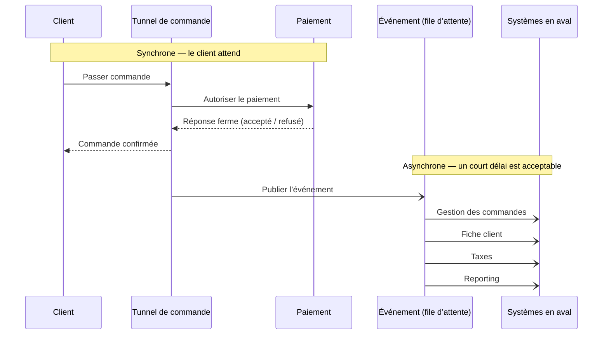

*Ceci est une étude de conception personnelle. Ce n'est pas un travail livré à un client, et elle ne contient aucun nom ni chiffre de client. Elle s'appuie sur le fonctionnement réel de l'intégration des commandes dans Salesforce Commerce Cloud. Les exemples utilisent les mécanismes de Commerce Cloud. Le raisonnement vaut pour toute plateforme de commerce.*

> **Pourquoi c'est important**
>
> Quand un client passe commande, beaucoup de systèmes doivent le savoir : l'entrepôt, la comptabilité, la fiche client, le système de taxes, le reporting. La solution facile consiste à les appeler pendant le tunnel de commande. Cela fonctionne avec deux systèmes. Avec dix, le tunnel de commande devient la partie la plus fragile de l'activité, et c'est justement celle que l'on veut voir tenir pendant une période de soldes.
>
> **La décision** — Laisser le tunnel de commande faire une seule chose : enregistrer une commande correcte et payée. Puis enregistrer cette commande une fois et laisser chaque autre système la reprendre séparément, à son rythme.
>
> **Ce que cela apporte** — De nouveaux systèmes peuvent être branchés sans toucher au tunnel de commande. Un système partenaire lent ou en panne ne peut plus empêcher les clients d'acheter. Le client obtient toujours une réponse claire sur le paiement avant la page de confirmation.
>
> **Le risque évité** — Que le tunnel de commande devienne le système dont tout dépend, où chaque nouvelle connexion est une modification du flux que l'on peut le moins se permettre de casser.

**En une phrase :** une commande est un fait unique dont plusieurs systèmes ont besoin. Enregistrez-la une fois et laissez chaque système la prendre quand il est prêt, au lieu de rendre le tunnel de commande responsable de chacun d'eux. Mais gardez la décision de paiement pendant que le client attend, car « probablement payé » n'est pas un état réel.

---

## Le problème

Beaucoup de systèmes s'intéressent à une nouvelle commande : la gestion des commandes et l'entrepôt, les taxes, la fiche client, le reporting, la fidélité, les e-mails. La conception simple appelle chacun d'eux directement dans le tunnel de commande, et attend la réponse de chacun.

Cela fonctionne avec deux systèmes. À partir du dixième, deux problèmes apparaissent.

**Le tunnel de commande devient fragile.** Un appel effectué pendant le tunnel se déroule pendant que le client attend. Sur Commerce Cloud, cet appel occupe l'un des fils d'exécution du serveur, en nombre limité, pendant toute sa durée. Si un système en aval passe d'un cinquième de seconde à cinq secondes, il ne ralentit pas seulement un client. Il épuise les fils d'exécution et peut faire tomber toute la boutique. Un partenaire lent devient une panne du site.

**Le tunnel de commande devient difficile à faire évoluer.** Ajouter un système signifie modifier le tunnel. L'équipe qui en est responsable devient donc un goulot d'étranglement pour des travaux qui ne la concernent pas.

Le vrai problème est structurel. On a rendu le tunnel de commande responsable de tous les systèmes qui s'intéressent aux commandes. Il devrait être responsable d'une seule chose : produire une commande correcte et payée, et enregistrer ce fait.

## La conception : enregistrer la commande, la livrer de façon fiable, laisser les systèmes suivre

Le principe comporte trois parties.

1. **Le tunnel enregistre la commande et s'arrête là.** Il n'appelle pas directement l'entrepôt ni la fiche client.
2. **Un traitement séparé livre la commande à chaque système,** en réessayant si un système est temporairement indisponible.
3. **Ajouter un système, c'est ajouter un abonné.** Le tunnel de commande ne change pas.

Un point important sur cette plateforme : Commerce Cloud n'a **pas de file d'attente intégrée**. « Enregistrer puis livrer plus tard » est donc quelque chose que l'on construit. Il y a deux façons habituelles de le faire. Vous pouvez stocker un enregistrement par livraison en attente dans la plateforme, et faire traiter cette liste par une tâche planifiée. Ou vous pouvez confier la commande à un intergiciel extérieur à la plateforme, ce qui est courant dans les grands parcs. Les deux donnent la même forme : le tunnel écrit, autre chose livre.

Au-dessus de la ligne, le client attend : cela doit être rapide et donner une réponse ferme. En dessous, chaque système prend la commande quand il est prêt.

Cela correspond aussi au partage des rôles de la plateforme. Commerce Cloud enregistre très bien une commande. Ce n'est pas un **système de gestion des commandes** — celui qui décide d'où vient le stock, organise la livraison et gère les retours. Ce système prend le relais après le paiement et devient l'enregistrement principal de la commande. Le statut revient ensuite vers la boutique pour que le client le voie dans son compte.

## La limite la plus importante

Reporter du travail n'est pas gratuit, et la compétence essentielle est de savoir où cela ne convient pas.

**La décision de paiement doit se faire pendant que le client attend.** Le client a droit à une réponse claire — accepté ou refusé — avant la page de confirmation. « Nous vous dirons plus tard si votre paiement a fonctionné » n'est pas acceptable, et « probablement payé » n'est pas un état qu'un système de commerce peut porter. La vérification du paiement est donc une étape bloquante dans le tunnel. La commande n'est passée, et ensuite seulement enregistrée pour les autres systèmes, qu'une fois le paiement approuvé.

Une distinction est utile ici. Approuver le paiement est la décision que le client attend. Prélever réellement l'argent se fait souvent plus tard, à l'expédition. La première ne peut pas être différée. La seconde le peut.

Tout ce qui suit une commande confirmée et payée — organiser l'expédition, déclarer les taxes, mettre à jour la fiche client, envoyer le reçu — peut accepter un court délai. Quelques secondes ou minutes suffisent. Ce que le client attend activement ne le peut pas. Le rôle de la conception est de tracer cette ligne correctement, et de ne pas laisser l'élégance du « tout se fait plus tard » pousser la décision de paiement du mauvais côté.

Cette seule distinction — ce que le client attend, par opposition à ce qui doit simplement se produire — sépare une conception fiable d'une conception à la mode.

## Options envisagées

| Option | Décision | Raisonnement |
| --- | --- | --- |
| **Enregistrer la commande, la livrer avec des tentatives répétées, les systèmes suivent** | **Retenue** | Sépare les autres systèmes du tunnel de commande. Ajouter un système ne coûte rien au tunnel, et une panne en aval n'empêche pas d'acheter. Le coût est d'accepter un court délai et de construire le mécanisme de livraison. |
| Appeler chaque système pendant le tunnel | Rejetée | Simple avec deux systèmes, risqué avec dix. Lie la disponibilité du tunnel à celle de tous les autres systèmes et exécute des appels lents pendant que le client attend. C'est la version qui transforme un partenaire lent en panne de site. |
| Tout reporter, y compris la décision de paiement | Rejetée | La version qui paraît élégante, et qui est fausse. Elle échange une vraie promesse faite au client contre de la propreté de conception. Certaines étapes doivent bloquer. L'approbation du paiement en fait partie. |
| Partager une base de données et laisser les systèmes y lire les commandes | Rejetée | Supprime l'appel direct mais crée une dépendance cachée sur la structure des données. Plus personne ne peut modifier les données de commande sans casser un autre système. Une dépendance cachée est pire qu'une dépendance visible. |

## Ce que je surveillerais en production

- **La même commande reçue deux fois.** Les tentatives répétées font qu'un système peut recevoir la même commande plusieurs fois. Chaque système receveur doit être **idempotent** — traiter deux fois la même commande doit avoir le même effet que la traiter une fois. La méthode habituelle est de se baser sur le numéro de commande, pour reconnaître et ignorer un doublon.
- **Le format de la commande est devenu une interface.** D'autres systèmes en dépendent. Versionnez-le. Une modification négligente casse silencieusement tous les abonnés.
- **Les messages impossibles à livrer.** Une commande défectueuse ne doit pas bloquer la file pour tout le monde. Mettez-la de côté pour analyse humaine et continuez.
- **Pouvoir répondre à « cette commande est-elle arrivée dans la fiche client ? ».** Dès que le travail se fait plus tard, la réponse n'est plus un simple message d'erreur. C'est une trace à travers plusieurs systèmes. Ajoutez une référence commune à chaque événement pour pouvoir la suivre.
- **Protéger la partie bloquante.** La décision de paiement, et tout ce que le client attend réellement, ne doit pas glisser discrètement vers le traitement différé. Et aucun appel vers un système en aval n'a sa place dans le tunnel de commande.

## Ce que cela apporte

- Le tunnel de commande cesse d'être le système dont tout dépend. Il produit des commandes payées et les enregistre.
- Ajouter un système ne coûte rien. Fidélité, nouvel outil de reporting, système de taxes d'un nouveau marché : tous peuvent s'abonner sans toucher au tunnel.
- Une panne en aval reste en aval. Un système client en difficulté ne peut pas empêcher le bouton d'achat de fonctionner.
- Le client obtient toujours une réponse franche sur le paiement, car la conception savait quelle promesse elle n'avait pas le droit de différer.

---

**Décision liée :** ADR-011 (traiter les événements de commande après le paiement) consigne ce choix en bref, y compris l'exception explicite qui garde la décision de paiement dans le tunnel de commande.
