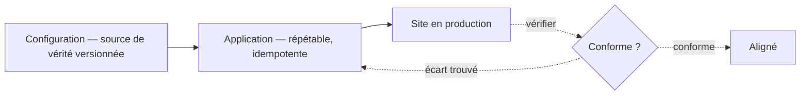

*Ceci est une étude de conception personnelle. Ce n'est pas un travail livré à un client, et elle ne contient aucun nom ni chiffre de client. Elle généralise un travail réel : j'ai proposé et conçu une méthode standard et répétable pour déployer une fonctionnalité de fidélité sur un grand parc Salesforce Commerce Cloud, ce qui a réduit l'effort de mise en place sur un nouveau site d'environ huit semaines à environ quatre jours. Cette étude reprend l'idée sous-jacente et la traite comme un problème d'architecture.*

> **Pourquoi c'est important**
>
> Quand chaque site est configuré à la main, de petites différences apparaissent. Avec le temps, aucun site n'est configuré comme un autre. Un correctif ne peut alors plus être déployé avec confiance, et chaque incident devient une enquête particulière. Le délai de lancement est le coût visible. Les écarts sont le coût réel.
>
> **La décision** — Tenir une configuration écrite et versionnée pour chaque site. La considérer comme la vérité. L'appliquer par une étape que l'on peut relancer sans risque.
>
> **Ce que cela apporte** — Lancer un nouveau site, ou une nouvelle fonctionnalité sur un site existant, passe de plusieurs semaines à quelques jours. L'effort cesse de croître avec la taille du parc : le centième site coûte bien moins que le premier.
>
> **Le risque évité** — Des écarts de configuration qui se répandent sur une centaine de sites, ce qui rend les changements risqués et les incidents lents à traiter.

**En une phrase :** un parc configuré à la main dérive. Un parc configuré à partir d'une description écrite, appliquée par une étape que l'on peut relancer sans risque, reste cohérent. Le second lance de nouveaux marchés en quelques jours au lieu de plusieurs semaines, et devient moins cher à exploiter en grandissant.

---

## Le problème

Imaginez un parc d'environ une centaine de sites de commerce sur une plateforme partagée. Chaque nouveau site a été mis en place à la main à partir d'une référence que tout le monde suivait à peu près. En configurer un prend plusieurs semaines de temps spécialisé.

Le coût que l'on remarque est le délai. Le coût qui fait vraiment mal, c'est la **dérive** : parce que chaque site est assemblé à la main, aucun n'est configuré exactement comme un autre. Un réglage change ici. Une étape est oubliée là. Un correctif est appliqué à un marché et pas aux autres. Six mois plus tard, il n'y a plus une plateforme, mais une centaine de plateformes légèrement différentes.

La dérive coûte cher de manières qui n'apparaissent pas dans un rapport de lancement.

- **Chaque incident devient une enquête particulière.** On ne peut pas raisonner sur « la configuration du tunnel de commande », puisque celle de chaque site est légèrement différente.
- **Chaque changement comporte un risque.** On ne peut pas déployer un correctif sur tout le parc avec confiance, car on ne sait pas comment chaque site réagira.
- **L'équipe grandit avec le parc.** Plus de sites veut dire plus de travail manuel, donc les effectifs augmentent avec le nombre de sites. C'est la courbe que la plupart des responsables veulent casser.

Le véritable objectif n'est donc pas « lancer un site plus vite ». C'est **empêcher le parc de se fragmenter en grandissant**, car le coût d'une centaine de sites différents dépasse largement celui d'un lancement.

## La question qui structure la conception

Posez une seule question : **quelle est la source de vérité pour la configuration attendue d'un site ?**

Aujourd'hui la réponse est « ce qui tourne actuellement, plus ce dont les gens se souviennent ». C'est là le problème. Tout le reste découle du fait de répondre autrement : **une description écrite et versionnée est la vérité, et le site en production n'en est qu'une copie à un instant donné.**

C'est le même changement que derrière le déploiement de fidélité réel. Au lieu de construire la fonctionnalité site par site, nous avons défini une manière standard de décrire ce dont un site avait besoin, et une manière répétable de l'appliquer. Déployer la fonctionnalité sur un nouveau site est devenu un travail de configuration plutôt qu'un petit projet.

## La conception

Quatre parties.

1. **La configuration comme source de vérité.** Une description écrite par site, conservée dans un dépôt versionné. Elle indique quelles fonctionnalités sont actives, quelles intégrations sont branchées, et quelles différences de marque et de marché s'appliquent. Sur Commerce Cloud, cela correspond à des éléments concrets : les réglages du site, l'ordre des couches de code, et les catalogues, listes de prix et listes de clients utilisés. Les personnes modifient cette description, et seulement elle.
2. **Une étape qui l'applique et que l'on peut relancer sans risque.** Elle lit la description et met le site en conformité. Idéalement elle est **idempotente** — un mot qui mérite une explication, car il porte toute l'idée. Une étape idempotente peut être relancée plusieurs fois et le résultat est le même qu'une seule exécution. Elle affirme ce qui doit être vrai (« ce réglage vaut X ; cette fonctionnalité est active ») au lieu d'exécuter des actions ponctuelles (« créer X »). La relancer ne change donc rien, ou corrige discrètement un écart.
3. **Un modèle en couches.** Une base partagée, avec les différences appliquées dans un ordre prévisible. L'essentiel d'un site vient de la base. La description ne consigne que les différences réelles.
4. **Une vérification ensuite.** Une fois appliquée, on compare le site à sa description. En cas de désaccord, c'est une dérive, signalée immédiatement plutôt que découverte pendant un incident.

La propriété qui fait fonctionner tout cela est l'étape répétable. Un script ponctuel *fait* des choses, donc le relancer échoue ou applique deux fois le changement. Une étape répétable *affirme* des choses, donc la relancer est sans risque. Cette seule propriété transforme la mise en place d'un événement risqué en quelque chose que l'on peut exécuter à tout moment pour confirmer qu'un site est toujours correct.

## Options envisagées

| Option | Décision | Raisonnement |
| --- | --- | --- |
| **La configuration comme vérité, appliquée par une étape répétable** | **Retenue** | C'est l'option la plus coûteuse au départ, et elle demande à l'équipe de décrire l'état final plutôt que les étapes. En retour, elle supprime la dérive et empêche l'effort de croître avec le parc. Le coût est payé une fois. Le bénéfice augmente avec chaque nouveau site. C'est la forme du déploiement réel passé de plusieurs semaines à quelques jours. |
| Une procédure manuelle écrite | Rejetée | La moins chère à mettre en place et rassurante à rédiger. Mais elle améliore un lancement, pas les cent suivants. La dérive revient dès qu'une personne saute une étape ou l'interprète autrement. Elle traite un problème de système comme un problème de discipline. |
| Reconstruire le parc en une seule instance partagée | Rejetée pour l'instant | L'état final le plus propre : une plateforme plutôt qu'une centaine de configurations. Mais c'est une migration de plusieurs trimestres sur du chiffre d'affaires en production. Non écartée — l'approche par configuration est un pas dans cette direction. |
| Un outil tiers de création de sites | Rejetée | Rapide à démarrer. Mais il ne pouvait pas exprimer les règles réelles d'intégration et de conformité du parc sans de nombreuses exceptions, ce qui recrée le même problème dans l'outil de quelqu'un d'autre. |

Les options rejetées comptent autant que celle retenue. Deux d'entre elles sont les options qui semblent peu coûteuses, et nommer précisément pourquoi elles échouent est l'essentiel. La troisième est la plus propre, et la discipline consiste à savoir quand le meilleur état final ne vaut pas encore le risque de mise en œuvre.

## Ce que je surveillerais en production

- **Les mots de passe et les clés n'ont pas leur place dans la configuration.** La description doit y faire référence ; un coffre séparé doit les conserver. Se tromper ici est la façon la plus courante de laisser fuiter des identifiants dans un dépôt versionné.
- **Une exécution qui s'arrête au milieu.** Une étape répétable rend la reprise sûre, mais une exécution interrompue doit laisser le site dans un état compréhensible. L'application des changements doit pouvoir reprendre, et non être tout ou rien.
- **Les différences réelles.** Parfois un marché a réellement besoin de quelque chose que la base ne peut pas exprimer. Il faut un moyen visible et volontaire de le consigner. Sinon les gens modifient directement le site en production et le problème revient. La règle : les différences sont permises, mais elles doivent être écrites dans la description, jamais improvisées sur le site en production.
- **La vérification doit être planifiée.** La configuration n'est la vérité que si la réalité lui est comparée régulièrement. Une vérification planifiée qui signale ou corrige les écarts est ce qui rend la promesse encore vraie six mois plus tard.
- **Le fonctionnement humain est la partie difficile.** La technique est la moitié la plus simple. Amener une équipe à cesser de modifier les sites en production et à modifier les descriptions est le vrai problème d'adoption. La méthode doit rendre la bonne façon de faire la plus facile, sinon les gens la contourneront. Dans le déploiement réel, l'adoption a eu lieu parce qu'un responsable produit a porté le modèle standard auprès de l'entreprise. Cela a compté autant que la conception.

## Ce que cela apporte

- Mettre en place un nouveau site, ou y ajouter une fonctionnalité, passe de plusieurs semaines à quelques jours. L'essentiel de ce qui reste est de la relecture plutôt que de la construction. Le déploiement de fidélité réel est passé d'environ huit semaines à environ quatre jours par site.
- L'effort cesse d'augmenter avec la taille du parc. Le centième site coûte bien moins que le premier, donc l'équipe n'a pas à grandir avec le nombre de sites.
- Les écarts tendent vers zéro. La même configuration produit le même site à chaque fois, donc analyser un incident cesse d'être une devinette et un correctif peut être déployé avec confiance.

Rien de tout cela ne vient d'un outil astucieux. Cela vient d'une seule décision — faire de la configuration la vérité, et rendre son application sûre à relancer — tenue face à toutes les raisons de le faire à la main juste cette fois.

---

**Décisions liées :** ADR-011 (traiter les événements de commande après le paiement) et ADR-014 (vitrine découplée plutôt qu'intégrée) accompagnent celle-ci. Problèmes différents, même réflexe : rendre les frontières visibles, et préférer des conceptions qu'une équipe peut comprendre sous pression.
