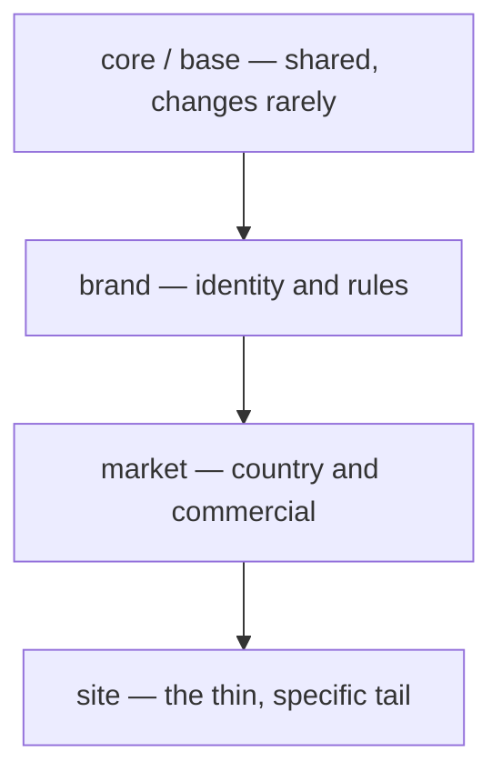

*A self-directed design study grounded in the layered commerce estate I work in daily — Salesforce Commerce Cloud (SFCC), across ~100 sites spanning many brands and markets. It works through a boundary-design problem I've lived from the inside, the options I weighed, and the reasoning behind where I'd draw the lines. Not a client deliverable — the judgment is the point. The concrete mechanism here is SFCC's cartridge model, but the principle carries across commerce platforms.*

> **Bottom line — for product & program stakeholders**
>
> **The decision** — Build many brands and markets on one shared base, and let each brand or market change only what it genuinely needs, as thin configuration on top — never by editing the shared code.
>
> **What it unlocks** — A new brand or market launches as configuration, not a rebuild; a shared improvement reaches every storefront at once; and the platform can keep taking upgrades instead of freezing.
>
> **The risk it removes** — The estate quietly fragmenting into a hundred bespoke sites that can't share a fix or a feature — the slow drift that turns one platform into a hundred maintenance problems.

**The one line:** *A multi-brand platform is a bet about where change happens. Draw the seam so that the things that rarely change and are shared sit on one side, and the things that vary per brand or market sit on the other — and a new brand becomes a configuration exercise instead of a fork.*

---

## Context — the boundary is the architecture

When one platform serves many brands across many markets, the hard part isn't any single feature. It's the **boundaries**: which behaviour is shared and owned centrally, and which is allowed to vary per brand or market — and, critically, *how* it's allowed to vary.

Get the boundaries right and the platform compounds: shared improvements reach every brand at once, and a new market ships as configuration. Get them wrong and you get one of two failure modes, both common:

- **Too rigid** — the shared core can't express what a market genuinely needs, so teams edit the shared code or bolt on escape hatches. Now you have a hundred quiet variations and you're back to drift.
- **Too loose** — everything is overridable, so nothing is truly shared. The "platform" is a thin veneer over a hundred bespoke sites, and no central improvement is safe.

The whole game is placing the seam so you land between those two.

## The forcing question

For any given piece of behaviour, the question is: **does this vary by brand or market, and who owns that variation?**

That single question decides which side of the seam it belongs on. In SFCC the layering is made concrete by the **cartridge path** — an ordered list of code layers, resolved most-specific first. A useful way to picture it, from most-shared to most-specific:

The estate I work in layers this even more finely — a **global → zone → brand → country → site** cartridge model — but the principle is the same at any depth. Behaviour resolves by *first match wins*: a site *is* the shared base, unless a brand layer overrides it, unless a market layer overrides that, unless the site itself does. Most of any given site is the top-shared layer. The lower you go, the less should live there.

## The design: a shared base, overridden — never edited

The mechanism that makes the seam hold, in SFCC terms, is the **cartridge path plus the no-edit-base discipline**:

- The shared layer (the platform base and your own **core** cartridge) defines the *contract and common behaviour* — checkout, cart, the integration plumbing every brand needs. It is **never edited in place**.
- Brand and market layers sit **earlier in the path** and **override** only what genuinely differs, using the platform's extension points (cartridge-path resolution, `module.superModule` to extend rather than replace, controller middleware like `server.append`) — so a brand changes behaviour *without touching the code it doesn't own*.
- The base stays pristine, which is what keeps the whole estate **upgradable**: you can take a new platform, plugin, or partner (LINK) version and re-apply nothing, because your overrides were never edits.

On the data side the same seam runs through the catalog and customer model: a **shared master catalog** holds the canonical product records once, while each site owns its **storefront catalog** — its own navigation, assortment, and merchandising. Shared *truth*, local *presentation*. Customer lists and price books get the same contained-vs-shared decision, driven by whether brands should share identity and whether markets need pricing autonomy.

The reason this works is that it names *what is stable* (the shared base and contract) and quarantines *what varies* (the brand/market overrides) on the far side of the seam. The central team owns a small, stable surface. Brand teams move fast in their own layers without being able to break each other — because they can't reach across the seam into code they don't own.

**The judgment call that separates good from bad here:** knowing when an override set has stopped being configuration and become its own product. If a brand's overrides start to outnumber the shared behaviour they sit on — or brand logic starts leaking *down* into the shared core — the honest move is not another exception. It's to recognise that this "brand" is really a separate product and give it its own boundary. Forcing genuinely divergent things to share a seam is how platforms calcify.

## Trade-offs considered

| Option | Decision | Reasoning |
| --- | --- | --- |
| **Shared base + thin brand/market override layers** | **Chosen** | Highest design cost — you have to actually decide what's shared and hold the line. In return, brands evolve independently, a new brand or market ships as configuration and thin overrides, and central fixes reach everyone at once. The seam does the work, and the base stays upgradable. |
| Fork / copy the base per brand | Rejected | Fastest for brand #2, ruinous by brand #20. Every shared fix must be re-applied N times; copies drift and miss upstream fixes; the platform stops existing. Optimises the second brand, punishes the twentieth. |
| Edit the shared base for each brand's needs | Rejected | The tempting shortcut. It works until the next platform upgrade, which it silently blocks — hand-edits to the base are the single biggest cause of un-upgradable estates. Rigidity dressed as convenience. |
| One rigid template, no real overrides | Rejected | Superficially "consistent," but the first market with a genuine local requirement forces an escape hatch — and escape hatches breed. Rigidity doesn't prevent divergence, it just makes divergence dishonest. |
| Fully independent headless front-ends per brand | Rejected (context-dependent) | Maximum team autonomy, but you pay for it in duplicated cross-cutting concerns (auth, payments, consent) and a fragmented customer experience. Right for genuinely different products; wrong for variations on a shared one. |

As always, the rejections carry the reasoning. Fork-per-brand is the *tempting fast* option; edit-the-base is the *tempting cheap* option; rigid-template is the *tempting tidy* option. All fail for the same underlying reason — they refuse to decide where variation is allowed, so it leaks in uncontrolled.

## What I'd watch in production

- **Leaky abstractions.** The moment the shared core starts special-casing "if brand X," the seam has failed — brand detail has leaked below the contract into code that's supposed to be common. That's the canary; treat it as a design bug, not a feature.
- **Override explosion.** Track the ratio of overridden to shared behaviour per brand. When it creeps up, that brand is telling you it wants to be its own product. Listen before it forces the issue.
- **Base drift.** If anyone edits the shared base or a partner/plugin cartridge in place, the estate quietly loses its upgradability. Guard it in code review and CI — a base edit is a finding, not a fix.
- **Shared-object blast radius.** A shared price book or shared content library assigned to many sites means one edit hits every assigned market. Where markets need autonomy, keep the object per-market; where they should move together, keep it shared — but decide it, don't discover it in production.
- **Conway's law.** The team boundaries have to match the code seams. If one team owns behaviour that spans the seam, the seam won't hold — organisational and architectural boundaries are the same boundary, and pretending otherwise is how good designs erode.

## What it buys

- **A new brand or market ships as configuration and thin overrides, not a fork** — the single biggest lever on time-to-market for a multi-brand estate.
- **Brands evolve in parallel without breaking each other**, because the shared base is the only thing they hold in common and it changes slowly and deliberately.
- **The base stays upgradable** — security and feature updates from the platform can be adopted, because nothing shared was ever hand-edited.
- **The central team owns a small, stable surface** instead of a hundred bespoke sites — which is what lets the platform improve without the team growing to match the brand count.
- **Everyone can reason about their own layer**, because the seam tells them exactly what they own and what they can rely on.

The mechanism isn't the clever part. The clever part is *where you put the line* — and the discipline to keep genuinely different things on different sides of it, and to never edit the code you don't own.

---

**Related decisions:** ADR-009 (explicit versioned API contracts over shared-database integration) is the same principle applied to system integration — refuse the hidden coupling, pay the interface cost on purpose. ADR-011 (order events consumed asynchronously) draws another seam, this time in time rather than structure.
