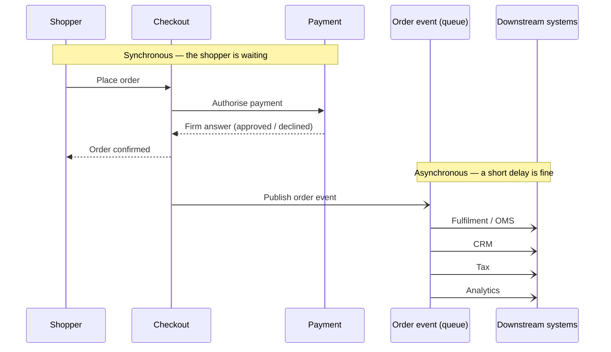

*This is a self-directed design study. It is not work delivered for a client, and it contains no client names or client numbers. It is grounded in how order integration actually works on Salesforce Commerce Cloud. The examples use Commerce Cloud mechanics. The reasoning applies to any commerce platform.*

> **Why this matters**
>
> When a shopper places an order, many systems need to know: the warehouse, finance, the customer record, the tax system, reporting. The easy design calls each of them during checkout. That works with two systems. With ten, checkout becomes the most fragile part of the business, and it is the part you least want to fail during a sale.
>
> **The decision** — Let checkout do one job: take a correct, paid order. Then record that order once and let each other system pick it up separately, on its own time.
>
> **What it gives you** — New systems can be connected without changing checkout. A slow or broken partner system can no longer stop shoppers from buying. The shopper still gets a clear yes or no on payment before the confirmation page.
>
> **The risk it removes** — Checkout becoming the system that everything else depends on, where each new connection is a change to the one flow you cannot afford to break.

**In one sentence:** an order is one fact that many systems need. Record it once and let each system take it when ready, instead of making checkout personally responsible for every system. But keep the payment decision while the shopper waits, because "probably paid" is not a real state.

---

## The problem

A lot of systems care about a new order: order management and the warehouse, tax, the customer record, reporting, loyalty, email. The simple design calls each one directly inside the checkout flow, and waits for each to answer.

This works with two systems. By the tenth it causes two problems.

**It makes checkout fragile.** A call made during checkout runs while the shopper waits. On Commerce Cloud, that call holds one of a limited number of server threads for as long as it takes. Threads are finite. If a downstream system slows from a fifth of a second to five seconds, it does not just slow one shopper. It uses up the threads and can bring the whole storefront down. One slow partner system becomes a site outage.

**It makes checkout hard to change.** Adding a new system means editing checkout. So the team that owns checkout becomes a bottleneck for work that has nothing to do with checkout.

The real issue is structural. Checkout has been made responsible for every system that cares about orders. It should be responsible for one thing: producing a correct, paid order, and recording that fact.

## The design: record the order, deliver it reliably, let systems catch up

The pattern has three parts.

1. **Checkout records the order and stops there.** It does not call the warehouse or the customer system directly.
2. **A separate worker delivers the order to each system,** retrying if a system is temporarily down.
3. **Adding a new system is a new subscriber.** Checkout does not change.

One important detail about this platform: Commerce Cloud has **no built-in message queue**. So "record it and deliver it later" is something you build. There are two normal ways to do it. You can store one record per pending delivery inside the platform and have a scheduled job work through the list. Or you can hand the order to middleware outside the platform, which is common in larger estates. Both give the same shape: checkout writes it down, something else delivers it.

Above the line the shopper is waiting, so it must be fast and give a definite answer. Below the line each system takes the order when it is ready.

This also matches how the platform divides the work. Commerce Cloud is very good at taking an order. It is not an **order management system** — the system that decides where stock comes from, arranges shipping, and handles returns. That system takes over after checkout and becomes the main record of the order. Status then flows back so the shopper can see it in their account.

## The limit that matters most

Doing work later is not free, and the important skill is knowing where it does not belong.

**The payment decision must happen while the shopper waits.** The shopper is entitled to a clear answer — accepted or declined — before the confirmation page. "We will tell you later whether your payment worked" is not acceptable, and "probably paid" is not a state a commerce system can hold. So the payment check is a blocking step inside checkout. The order is only placed, and only then recorded for other systems, once payment is approved.

There is a useful distinction here. Approving the payment is the decision the shopper waits for. Actually taking the money often happens later, when the goods ship. The first cannot be delayed. The second can.

Everything after a confirmed, paid order — arranging fulfilment, tax reporting, updating the customer record, sending the receipt — can accept a short delay. A few seconds or minutes is fine. Anything the shopper is actively waiting for cannot. The job of the design is to draw that line correctly, and not let the neatness of "everything happens later" push the payment decision to the wrong side of it.

That single distinction — what the shopper is waiting for, versus what merely needs to happen — is what separates a reliable design from a fashionable one.

## Options considered

| Option | Decision | Reasoning |
| --- | --- | --- |
| **Record the order, deliver it with retries, systems catch up** | **Chosen** | Separates other systems from checkout. New systems cost checkout nothing, and a failure downstream cannot stop shoppers buying. The cost is accepting a short delay and building the delivery mechanism. |
| Call each system during checkout | Rejected | Simple for two systems, unsafe for ten. It ties checkout's availability to every other system and runs slow calls on the shopper's thread. This is the version that turns one slow partner into a site outage. |
| Do everything later, including the payment decision | Rejected | The neat-looking version, and wrong. It trades a real promise to the shopper for design tidiness. Some steps must block. Payment approval is one. |
| Share a database and let systems read orders from it | Rejected | Removes the direct call but creates a hidden dependency on the data structure. Now nobody can change the order data without breaking another system. A hidden dependency is worse than a visible one. |

## What I would watch in production

- **The same order arriving twice.** Retries mean a system may receive the same order more than once. Each receiving system must be **idempotent** — processing the same order twice must have the same effect as processing it once. The usual way is to key the work on the order number, so a repeat is recognised and ignored.
- **The order format is now an interface.** Other systems depend on its shape. Version it. A careless change breaks every subscriber quietly.
- **Messages that can never be delivered.** One bad order should not block the queue for everyone. Move it aside for a human to look at, and keep going.
- **Being able to answer "did this order reach the customer system?"** Once work happens later, that question is no longer a single error message. It is a trail across systems. Put a shared reference on every event so it can be followed.
- **Protecting the part that blocks.** The payment decision, and anything else the shopper truly waits for, must not quietly move to the later path. And no downstream call belongs inside checkout.

## What it gives you

- Checkout stops being the system everything depends on. It produces paid orders and records them.
- New systems cost nothing to add. Loyalty, a new reporting tool, or a new market's tax system can subscribe without touching checkout.
- A failure downstream stays downstream. A struggling customer system cannot stop the buy button working.
- The shopper still gets a straight answer on payment, because the design knew which promise it was not allowed to delay.

---

**Related decision:** ADR-03 (handle order events after checkout, not during it) records this in short form, including the explicit exception that keeps the payment decision inside checkout.
