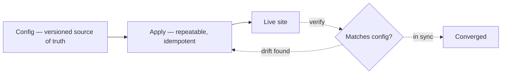

*This is a self-directed design study. It is not work delivered for a client, and it contains no client names or client numbers. It generalises a real piece of work: I proposed and designed a standard, repeatable way to roll out a loyalty feature across a large Salesforce Commerce Cloud estate, which reduced the effort to launch it on a new site from around eight weeks to around four days. This study takes the idea behind that and works through it as an architecture problem.*

> **Why this matters**
>
> When each site is set up by hand, small differences appear. Over time no two sites are configured the same way. Then a fix cannot be rolled out with confidence, and every incident becomes its own investigation. The launch time is the visible cost. The differences are the expensive one.
>
> **The decision** — Keep one written, version-controlled configuration for each site. Treat that as the truth. Apply it with a step that is safe to run again and again.
>
> **What it gives you** — Launching a new site, or a new feature on an existing site, moves from weeks to days. Effort stops growing with the size of the estate: the hundredth site costs far less than the first.
>
> **The risk it removes** — Configuration differences spreading across a hundred sites, which is what makes changes risky and incidents slow.

**In one sentence:** an estate set up by hand drifts apart. An estate set up from a written configuration, applied by a step that can safely be repeated, stays consistent. The second one launches new markets in days instead of weeks, and gets cheaper to run as it grows.

---

## The problem

Picture a commerce estate of around a hundred storefronts on one shared platform. Each new site was set up by hand from a reference build that everyone mostly followed. Setting one up takes weeks of specialist time.

The cost people notice is the launch time. The cost that actually hurts is **drift**: because each site is assembled by hand, no two end up configured the same way. A setting is changed here. A step is skipped there. A fix is applied to one market and not the others. Six months later there is no single platform. There are a hundred slightly different ones.

Drift is expensive in ways that do not show up on a launch report.

- **Every incident becomes its own investigation.** You cannot reason about "the checkout configuration", because each site's is slightly different.
- **Every change carries risk.** You cannot roll a fix across the estate with confidence, because you do not know what each site will do.
- **The team grows with the estate.** More sites mean more manual work, so headcount rises with the number of sites. This is the line most leaders actually want to break.

So the real goal is not "launch one site faster". It is **stop the estate from splitting apart as it grows**, because the cost of a hundred different sites is far larger than the cost of any one launch.

## The question that shapes the design

Ask one question: **what is the source of truth for how a site should be configured?**

Today the answer is "whatever is currently running, plus what people remember". That is the problem. Everything else follows from changing the answer to: **a written, version-controlled configuration is the truth, and the running site is just its current copy.**

This is the same shift behind the real loyalty rollout. Instead of building the feature site by site, we defined a standard way to describe what a site needed, and a repeatable way to apply it. Launching the feature on a new site became a configuration job rather than a small project.

## The design

Four parts.

1. **Configuration as the source of truth.** One written description per site, kept in version control. It says which features are on, which integrations are connected, and which brand and market differences apply. On Commerce Cloud these map to real things: site settings, the layered code path, and which catalog, price list, and customer list the site uses. People edit this description, and only this.
2. **A step that applies it, and is safe to repeat.** It reads the description and makes the live site match. Ideally it is **idempotent** — a word worth explaining, because it carries the whole idea. An idempotent step can be run many times and the result is the same as running it once. It states what should be true ("this setting is X; this feature is switched on") rather than performing one-time actions ("create X"). So running it again either changes nothing, or quietly corrects something that has drifted.
3. **A layered template.** A shared base, with differences applied in a predictable order. Most of a site is the base. The description only records where the site genuinely differs.
4. **A check afterwards.** Once applied, compare the live site back to its description. If they disagree, that is drift, and it is reported straight away rather than discovered during an incident.

The property that makes this work is the repeatable step. A one-time script *does* things, so running it twice either fails or applies the change twice. A repeatable step *asserts* things, so running it twice is safe. That single property turns setup from a risky one-off event into something you can run any time to confirm a site is still correct.

## Options considered

| Option | Decision | Reasoning |
| --- | --- | --- |
| **Configuration as truth, applied by a repeatable step** | **Chosen** | Costs the most up front, and asks the team to describe the end state rather than the steps. In return it removes drift and stops effort growing with the estate. The cost is paid once. The benefit grows with every new site. This is the shape behind the real weeks-to-days rollout. |
| A written manual procedure | Rejected | Cheapest to introduce and reassuring to write. But it improves one launch, not the hundred that follow. Drift returns as soon as a person skips or interprets a step differently. It treats a system problem as a discipline problem. |
| Rebuild the estate as one shared tenant | Rejected for now | The cleanest end state: one platform rather than a hundred configurations. But it is a multi-quarter migration across live revenue. Not dismissed — the configuration approach is a step towards it. |
| A third-party site builder | Rejected | Fast to start. But it could not express the estate's real integration and compliance rules without many exceptions, which recreates the same problem inside someone else's tool. |

The rejected options matter as much as the chosen one. Two of them are the cheap-looking options, and naming exactly why they fail is the point. The third is the cleanest option, and the discipline is knowing when the better end state is not worth the delivery risk yet.

## What I would watch in production

- **Passwords and keys do not belong in the configuration.** The description should refer to them; a separate secret store should hold them. Getting this wrong is the most common way this approach leaks credentials into version control.
- **A run that stops half way.** A repeatable step makes retrying safe, but a run that fails part way must leave the site in a state you can understand. Applying changes must be resumable, not all-or-nothing.
- **Real differences.** Sometimes a market genuinely needs something the base cannot express. There must be a visible, deliberate way to record that. Otherwise people make the change directly on the live site and the problem returns. The rule: differences are allowed, but they must be written in the description, never improvised on the running site.
- **The check has to run on a schedule.** The configuration is only the truth if reality is compared against it regularly. A scheduled check that reports or corrects differences is what keeps the promise real six months later.
- **The human workflow is the hard part.** The technology is the easier half. Getting a team to stop editing live sites and start editing descriptions is the real adoption problem. The approach has to make the correct way the easy way, or people will work around it. In the real rollout, adoption happened because a product owner supported the standard model with the business. That mattered as much as the design.

## What it gives you

- Setting up a new site, or adding a feature to one, moves from weeks to days. Most of what remains is review rather than build. The real loyalty rollout moved from around eight weeks to around four days per site.
- Effort stops rising with the size of the estate. The hundredth site costs far less than the first, so the team does not have to grow with the site count.
- Differences approach zero. The same configuration produces the same site every time, so investigating an incident stops being guesswork and a fix can be rolled out with confidence.

None of this comes from a clever tool. It comes from one decision — make the configuration the truth, and make applying it safe to repeat — held consistently against every reason to do it by hand just this once.

---

**Related decisions:** ADR-011 (handle order events after checkout) and ADR-014 (headless storefront over a combined one) sit alongside this. Different problems, same instinct: make the boundaries visible, and prefer designs a team can reason about under pressure.
